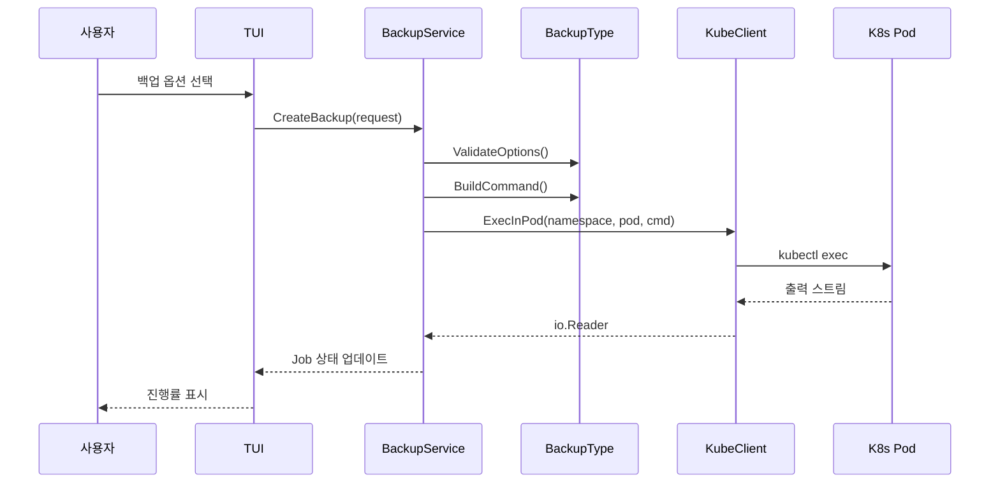
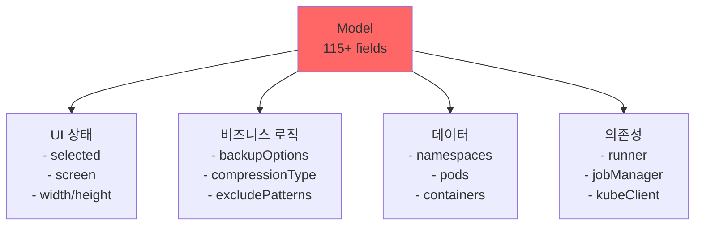
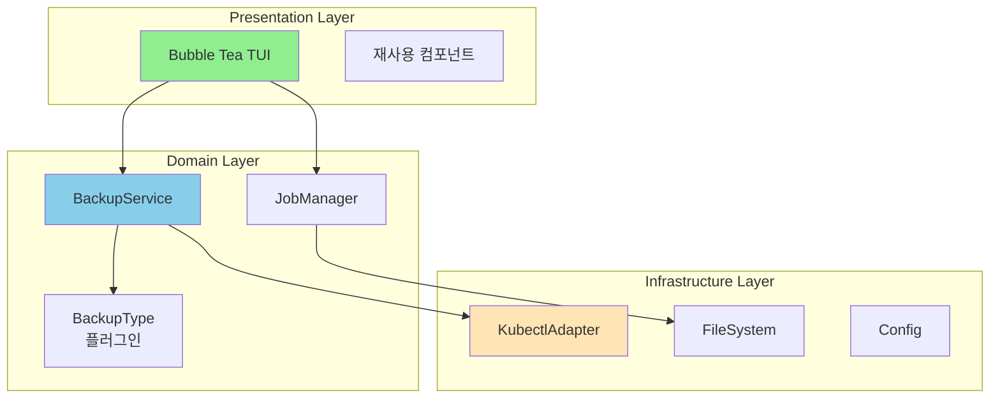
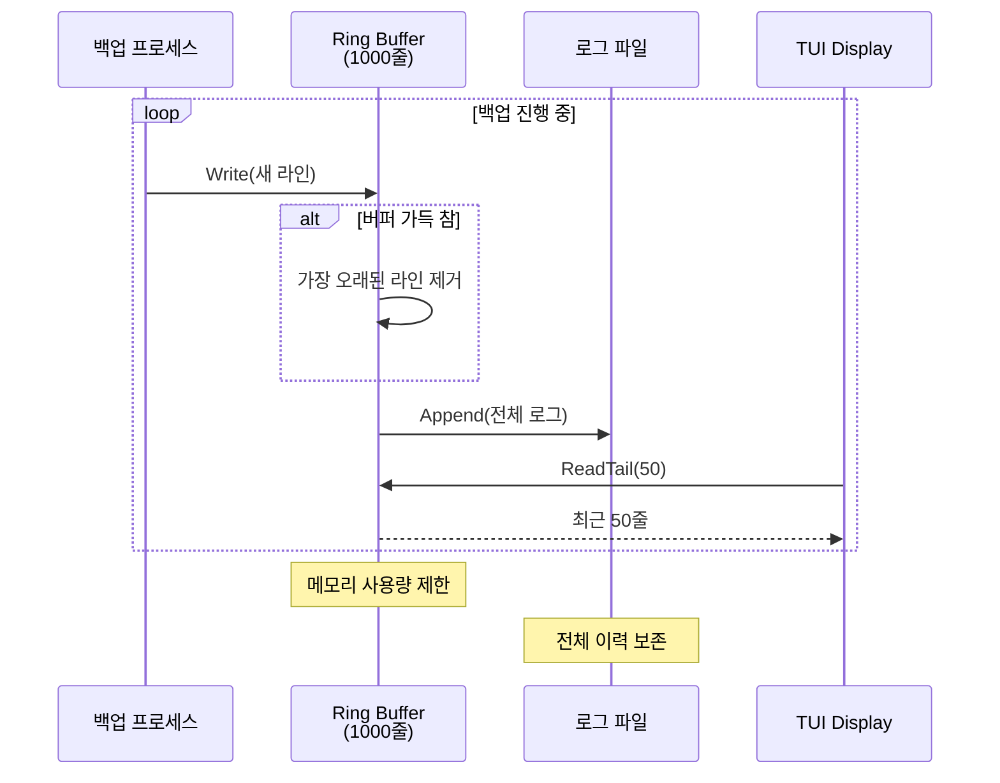
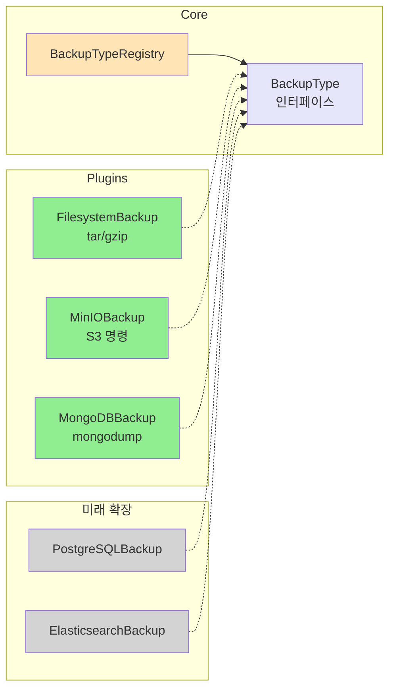

# 핵심 다이어그램

## 1. 백업 실행 플로우

## 2. 현재 문제: God Object

## 3. 개선: 계층 분리

## 4. Ring Buffer 메모리 관리

## 5. BackupType 플러그인 확장

## 다이어그램 설명

### 1. **백업 실행 플로우**
- 사용자 선택부터 Pod 내부 실행까지 전체 흐름
- 핵심: kubectl exec를 통한 Pod 접근

### 2. **God Object 문제**
- 현재 Model이 모든 책임을 가짐
- 테스트와 유지보수가 어려움

### 3. **계층 분리 개선**
- 명확한 레이어 구분
- 각 레이어는 인터페이스로만 통신

### 4. **Ring Buffer 메모리 관리**
- 메모리 사용량을 1000줄로 제한
- 전체 로그는 파일로 보존

### 5. **플러그인 확장성**
- 새 백업 타입 추가가 용이
- 기존 코드 수정 없이 확장 가능