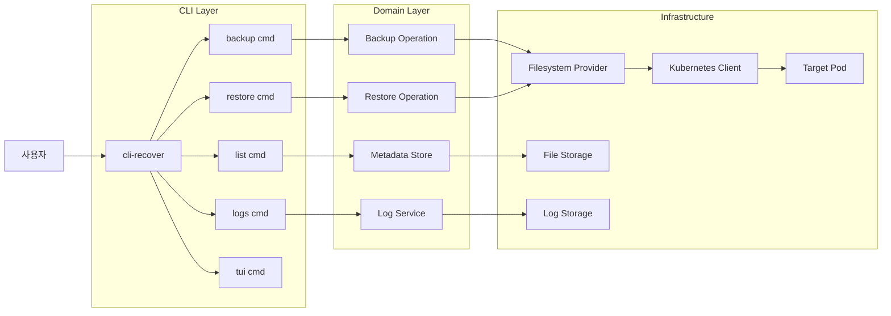
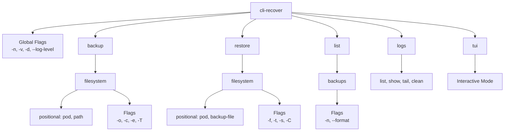
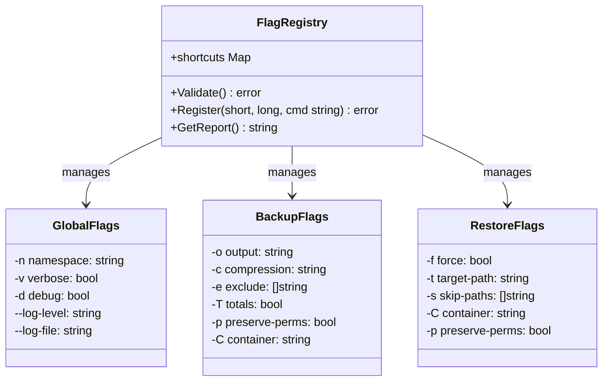
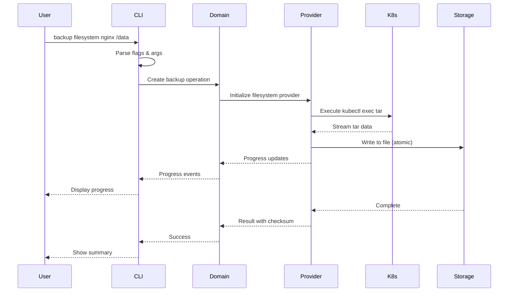
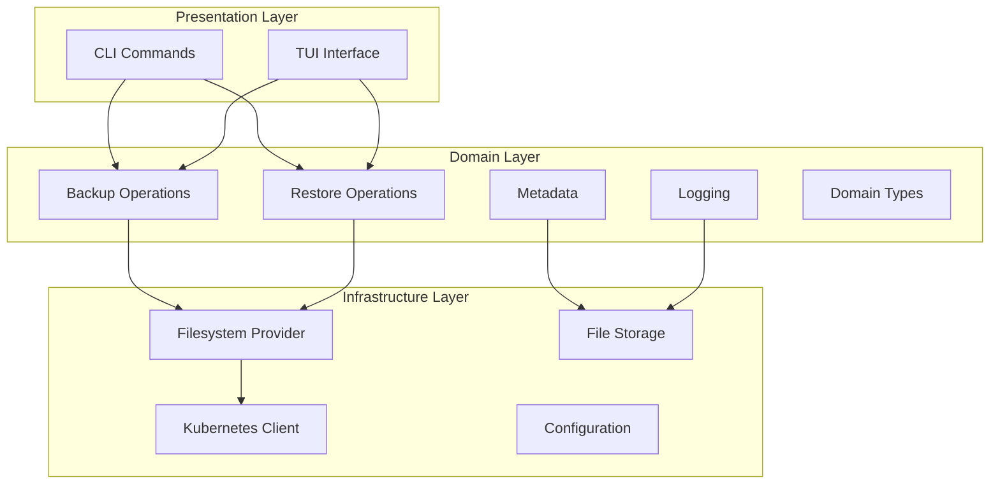

# CLI 디자인 가이드 개요

## 목적
이 가이드는 `cli-recover` 프로젝트의 CLI 인터페이스 설계 원칙과 구현 패턴을 문서화합니다. 일관성 있고 사용자 친화적인 명령줄 도구를 만들기 위한 지침을 제공합니다.

## 핵심 디자인 철학

### 1. **일관성 (Consistency)**
모든 명령어와 플래그가 예측 가능한 패턴을 따릅니다.

### 2. **명확성 (Clarity)**  
사용자가 추측하지 않아도 되는 직관적인 인터페이스를 제공합니다.

### 3. **친숙함 (Familiarity)**
kubectl, docker 등 널리 사용되는 도구와 유사한 패턴을 채택합니다.

### 4. **단순함 (Simplicity)**
CLAUDE.md의 Occam's Razor 원칙을 따라 복잡도를 최소화합니다.

## 아키텍처 관계도

### 전체 시스템 플로우

### 명령어 구조 계층

### 플래그 관리 시스템

## 데이터 플로우

### 백업 작업 플로우

## 2계층 아키텍처 (Phase 3.9)

### 레이어 책임 분리

## 주요 설계 결정

### 1. Positional Arguments vs Flags
- **필수 정보**: Positional arguments 사용 (pod, path)
- **선택적 정보**: Flags 사용 (-o, -c, -e)
- **향후 계획**: 하이브리드 접근법으로 양쪽 모두 지원

### 2. 플래그 단축키 관리
- 중앙 집중식 관리로 충돌 방지
- 컴파일 타임 검증
- 일관된 네이밍 규칙

### 3. 사용자 피드백
- 3단계 피드백: 시작 → 진행 → 완료
- 명확한 에러 메시지와 해결 방법 제시
- 위험한 작업에 대한 확인 프로세스

## 문서 구조

1. **00-overview.md** (현재 문서) - 전체 아키텍처와 철학
2. **01-command-patterns.md** - 명령어 설계 패턴
3. **02-flag-management.md** - 플래그 시스템 상세
4. **03-user-experience.md** - 사용자 경험 가이드
5. **04-implementation-guide.md** - 구현 가이드라인
6. **05-testing-strategy.md** - 테스트 전략

## 참고 사항

이 가이드는 CLAUDE.md의 원칙, 특히 **RULE_01 (Occam's Razor)**을 준수하여 작성되었습니다. 모든 설계 결정은 복잡도를 최소화하면서도 사용성을 극대화하는 방향으로 이루어졌습니다.