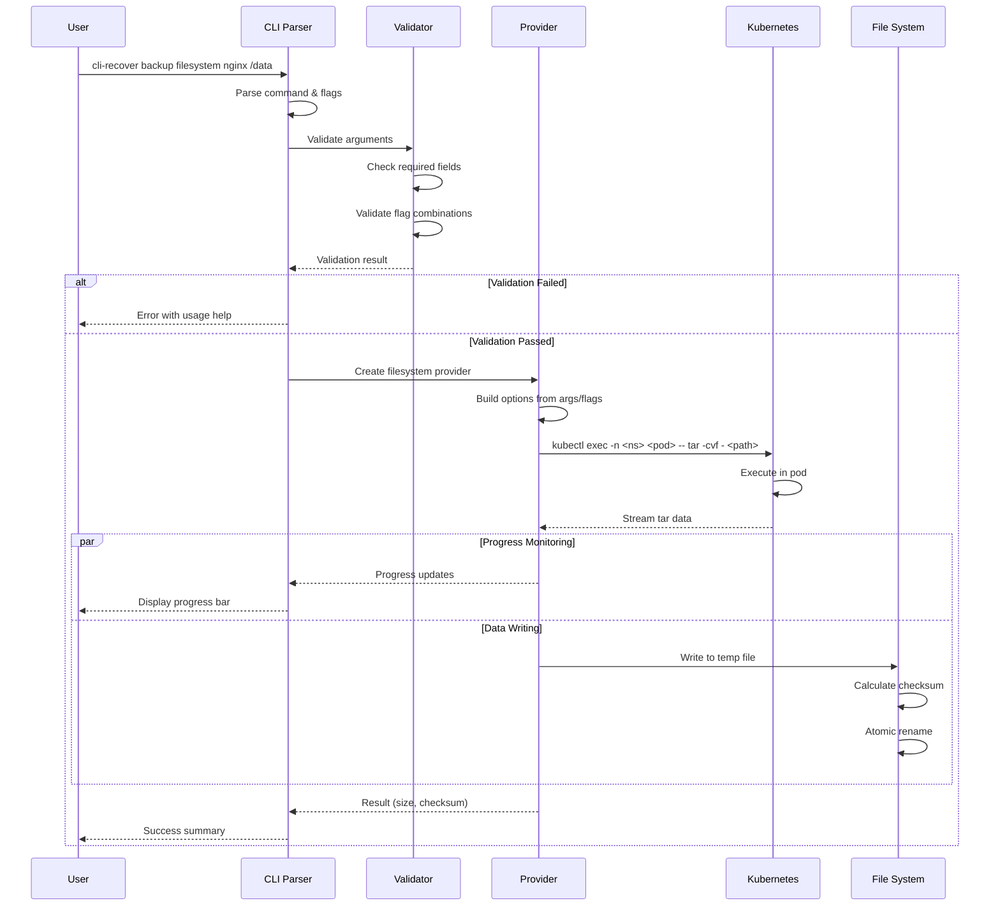
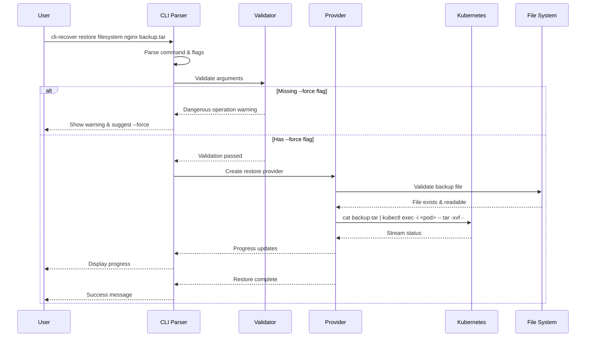
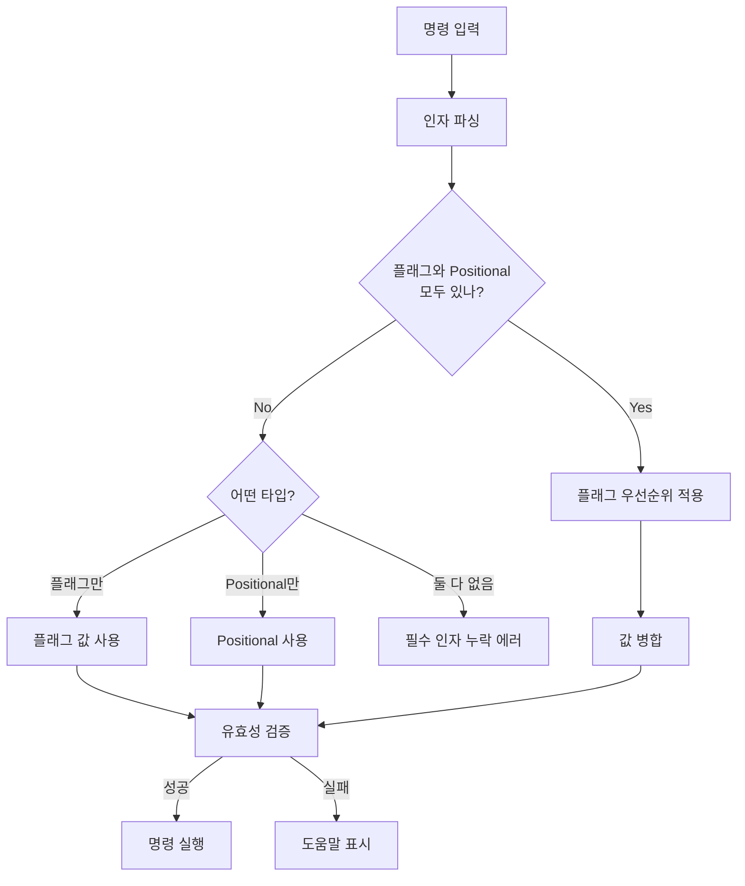
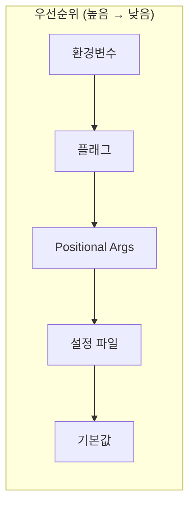
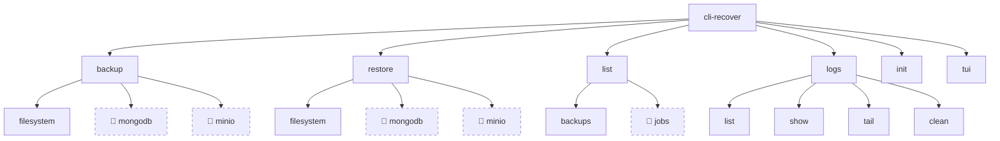
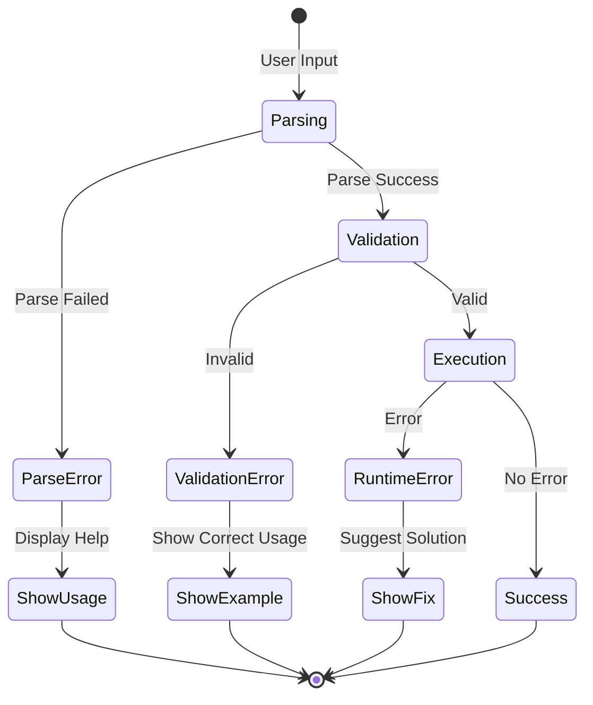
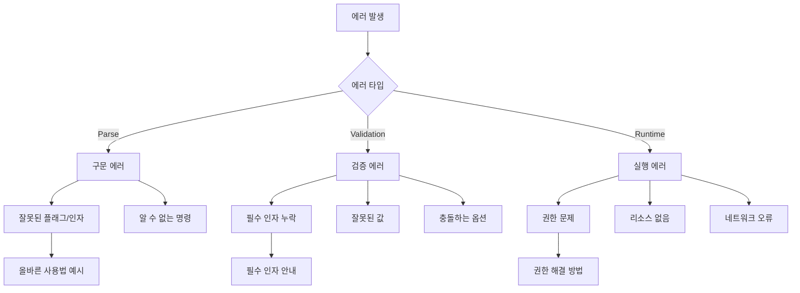
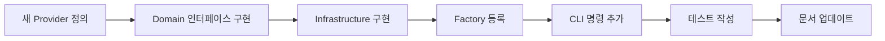
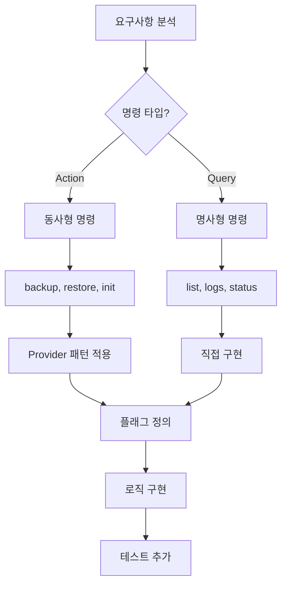

# 명령어 패턴과 구조

## 기본 명령어 패턴

### POSIX/GNU 표준 패턴
```
APPNAME VERB NOUN [OPTIONS] [ARGUMENTS]
```

### cli-recover 패턴
```
cli-recover [COMMAND] [SUBCOMMAND] [ARGS] [FLAGS]
```

## 명령어 실행 플로우

### Backup 명령 실행 흐름


### Restore 명령 실행 흐름


## 플래그와 인자 처리 패턴

### 하이브리드 인자 처리


### 플래그 우선순위 규칙


## 명령어 계층 구조

### 명령어 트리


## 에러 처리 패턴

### 에러 플로우


### 에러 메시지 구조


## Cobra 명령 구조

### 명령어 정의 패턴
```go
// 기본 구조
cmd := &cobra.Command{
    Use:   "subcommand [args]",
    Short: "짧은 설명",
    Long:  `긴 설명...`,
    Args:  cobra.ExactArgs(2), // 인자 검증
    RunE:  executeFunction,     // 실행 함수
}

// 플래그 추가
cmd.Flags().StringP("output", "o", "", "Output file")
cmd.Flags().BoolP("force", "f", false, "Force operation")
```

### 실행 함수 패턴
```go
func executeBackup(provider string, cmd *cobra.Command, args []string) error {
    // 1. 옵션 빌드
    opts := buildOptions(cmd, args)
    
    // 2. 검증
    if err := validateOptions(opts); err != nil {
        return fmt.Errorf("validation failed: %w", err)
    }
    
    // 3. Provider 생성
    p := createProvider(provider)
    
    // 4. 실행
    result, err := p.Execute(context.Background(), opts)
    if err != nil {
        return fmt.Errorf("execution failed: %w", err)
    }
    
    // 5. 결과 표시
    displayResult(result)
    return nil
}
```

## 명령어 확장 패턴

### 새 Provider 추가 시


### 새 명령어 추가 시


## 모범 사례

### 1. 명령어 이름
- 동작은 동사로: `backup`, `restore`, `init`
- 조회는 명사로: `list`, `logs`
- 명확하고 짧게: `list backups` (not `show-all-backup-files`)

### 2. 플래그 설계
- 짧은 형식은 자주 사용하는 것만
- 위험한 작업은 긴 형식만: `--force`, `--dry-run`
- Boolean 플래그는 긍정형으로: `--verbose` (not `--quiet`)

### 3. 인자 순서
- 중요도 순: `<필수> <선택>`
- 자연스러운 순서: `<source> <destination>`
- 일관성 유지: 모든 명령에서 동일한 순서

### 4. 에러 처리
- 명확한 에러 메시지
- 해결 방법 제시
- 관련 명령어 안내
- 종료 코드 일관성