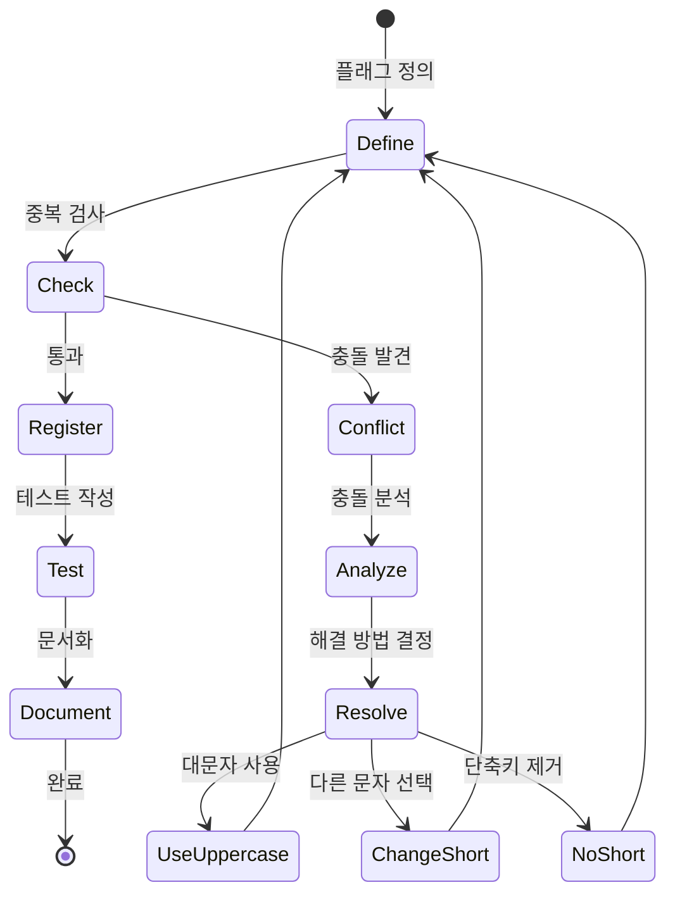
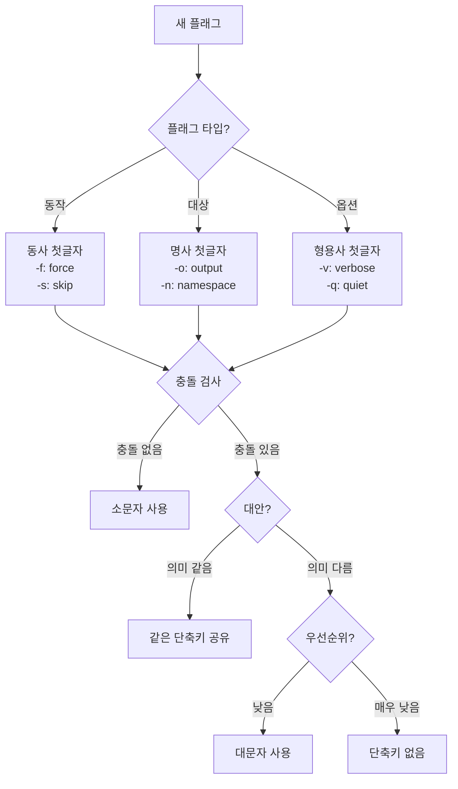
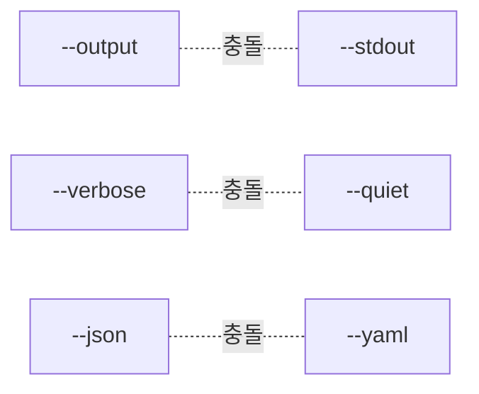

# 플래그 관리 시스템

## 플래그 설계 원칙

### 1. 일관성 원칙
- 같은 의미는 같은 플래그 사용
- 모든 명령에서 동일한 단축키
- 충돌 시 명확한 규칙 적용

### 2. 명확성 원칙
- 플래그 이름은 목적을 명확히 표현
- 단축키는 직관적으로 연상 가능
- 위험한 작업은 긴 형식만 제공

### 3. 호환성 원칙
- POSIX/GNU 표준 준수
- kubectl/docker 패턴 참고
- 기존 사용자 습관 고려

## 현재 플래그 충돌 현황

### 충돌 매트릭스
| Short | Long | backup filesystem | restore filesystem | Global | 충돌 여부 |
|-------|------|-------------------|--------------------|---------|-----------| 
| -n | --namespace | ✓ | ✓ | ✓ | ✅ 일관됨 |
| -v | --verbose | ✓ | ✓ | ✓ | ✅ 일관됨 |
| -o | --output | ✓ | - | - | ⚠️ |
| -o | --overwrite | - | ✓ | - | ❌ 충돌! |
| -c | --compression | ✓ | - | - | ⚠️ |
| -c | --container | - | ✓ | - | ❌ 충돌! |
| -t | --totals | ✓ | - | - | ⚠️ |
| -t | --target-path | - | ✓ | - | ❌ 충돌! |
| -p | --preserve-perms | ✓ | ✓ | - | ✅ 일관됨 |
| -e | --exclude | ✓ | - | - | ✅ |
| -s | --skip-paths | - | ✓ | - | ✅ |
| -d | --debug | - | - | ✓ | ✅ |

## 플래그 충돌 해결 방안

### 즉시 수정 필요
```diff
# backup filesystem
- -o, --output       # 유지
- -c, --compression  # 유지  
- -t, --totals       → -T, --totals  # 대문자로 변경

# restore filesystem  
- -o, --overwrite    → -f, --force    # 의미 명확화
- -c, --container    → -C, --container # 대문자로 변경
- -t, --target-path  # 유지
```

### 수정 후 매트릭스
| Short | Long | backup | restore | 용도 |
|-------|------|--------|---------|------|
| -n | --namespace | ✓ | ✓ | 네임스페이스 |
| -v | --verbose | ✓ | ✓ | 상세 출력 |
| -o | --output | ✓ | - | 출력 파일 |
| -f | --force | - | ✓ | 강제 실행 |
| -c | --compression | ✓ | - | 압축 방식 |
| -C | --container | ✓ | ✓ | 컨테이너 |
| -t | --target-path | - | ✓ | 대상 경로 |
| -T | --totals | ✓ | - | 전송 총계 |

## 플래그 등록 프로세스



## 플래그 네이밍 규칙

### 단축키 선택 가이드


### 플래그 카테고리별 규칙

#### 1. 글로벌 플래그 (최우선)
```yaml
-n, --namespace:    모든 명령에서 동일
-v, --verbose:      모든 명령에서 동일  
-h, --help:         자동 제공
-d, --debug:        디버그 모드
```

#### 2. 공통 작업 플래그
```yaml
-o, --output:       출력 관련 (파일, 형식)
-f, --force:        강제 실행 (위험 작업)
-y, --yes:          자동 확인
-q, --quiet:        조용한 모드
```

#### 3. 필터링 플래그
```yaml
-e, --exclude:      제외 패턴
-i, --include:      포함 패턴
-s, --skip:         건너뛰기
-a, --all:          모두 선택
```

#### 4. 설정 플래그
```yaml
-c, --config:       설정 파일
-C, --container:    컨테이너 (대문자)
-p, --preserve:     보존 옵션
-P, --path:         경로 (대문자)
```

## 플래그 검증 시스템

### 중앙 레지스트리 구조
```go
// flags/registry.go
package flags

var Registry = struct {
    // Global
    Namespace    string
    Verbose      string
    Debug        string
    
    // Backup
    Output       string
    Compression  string
    Exclude      string
    Totals       string
    
    // Restore
    Force        string
    TargetPath   string
    Container    string
    SkipPaths    string
}{
    // Global
    Namespace:   "n",
    Verbose:     "v",
    Debug:       "d",
    
    // Backup
    Output:      "o",
    Compression: "c", 
    Exclude:     "e",
    Totals:      "T", // 대문자로 충돌 회피
    
    // Restore
    Force:       "f", // 기존 overwrite 대체
    TargetPath:  "t",
    Container:   "C", // 대문자로 충돌 회피
    SkipPaths:   "s",
}
```

### 컴파일 타임 검증
```go
// flags/validate.go
func init() {
    if err := validateNoDuplicates(); err != nil {
        panic(fmt.Sprintf("Flag shortcut conflict: %v", err))
    }
}

func validateNoDuplicates() error {
    seen := make(map[string]string)
    
    // Reflection으로 모든 필드 검사
    v := reflect.ValueOf(Registry)
    t := v.Type()
    
    for i := 0; i < v.NumField(); i++ {
        fieldName := t.Field(i).Name
        shortcut := v.Field(i).String()
        
        if shortcut == "" {
            continue
        }
        
        if existing, exists := seen[shortcut]; exists {
            return fmt.Errorf("'-%s' used by both %s and %s", 
                shortcut, existing, fieldName)
        }
        
        seen[shortcut] = fieldName
    }
    
    return nil
}
```

## 플래그 사용 가이드라인

### 1. 새 플래그 추가 시
1. Registry에 추가
2. 의미와 용도 문서화
3. 충돌 검사 통과 확인
4. 테스트 작성
5. 도움말 업데이트

### 2. 플래그 변경 시
1. 하위 호환성 고려
2. Deprecation 경고 추가
3. 마이그레이션 가이드 제공
4. 최소 2개 버전 유지

### 3. 플래그 제거 시
1. Deprecation 공지 (최소 3개월)
2. 대체 방법 안내
3. 단계적 제거

## 특수 플래그 처리

### 위험한 작업 플래그
```yaml
--force:      단축키 제공 (-f)
--dry-run:    단축키 없음 (실수 방지)
--yes:        단축키 제공 (-y)
--no-prompt:  단축키 없음
```

### 상호 배타적 플래그


## 플래그 문서 자동 생성

### 마크다운 테이블 생성
```go
func GenerateFlagDocs() string {
    var doc strings.Builder
    
    doc.WriteString("| Short | Long | Description | Default |\n")
    doc.WriteString("|-------|------|-------------|---------|\\n")
    
    // 각 명령별로 플래그 정보 수집
    // 자동으로 테이블 생성
    
    return doc.String()
}
```

## 향후 개선 사항

### Phase 3.12 구현 계획
1. 플래그 충돌 해결
2. 레지스트리 시스템 구현
3. 하이브리드 args/flags 지원
4. 자동 문서 생성 도구

### 장기 계획
1. 플래그 별칭 지원
2. 환경 변수 통합
3. 설정 파일 연동
4. 플래그 그룹화