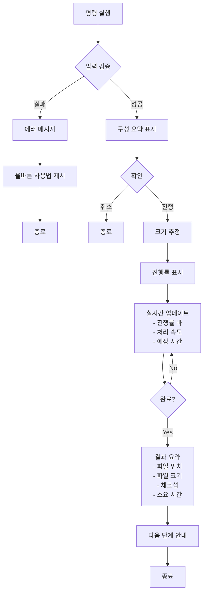
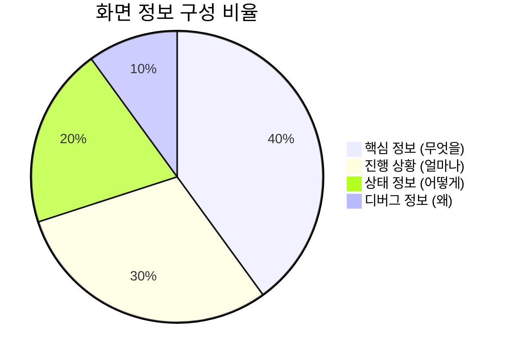
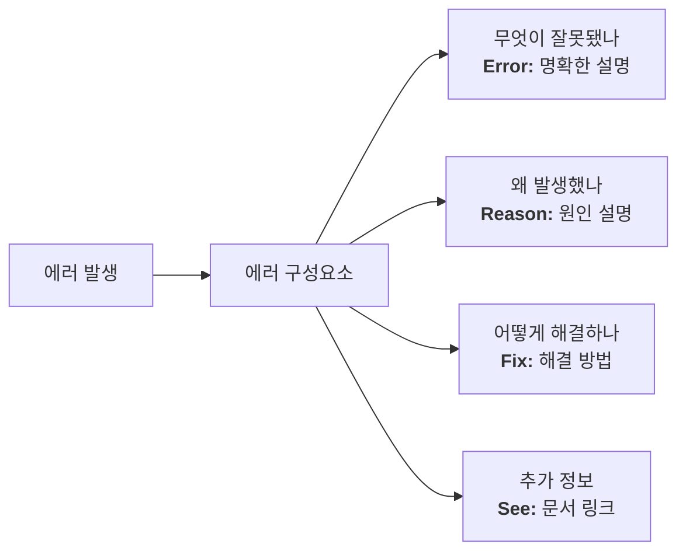
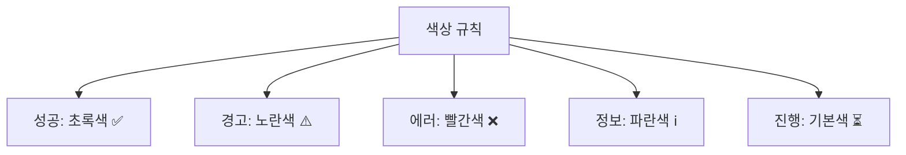
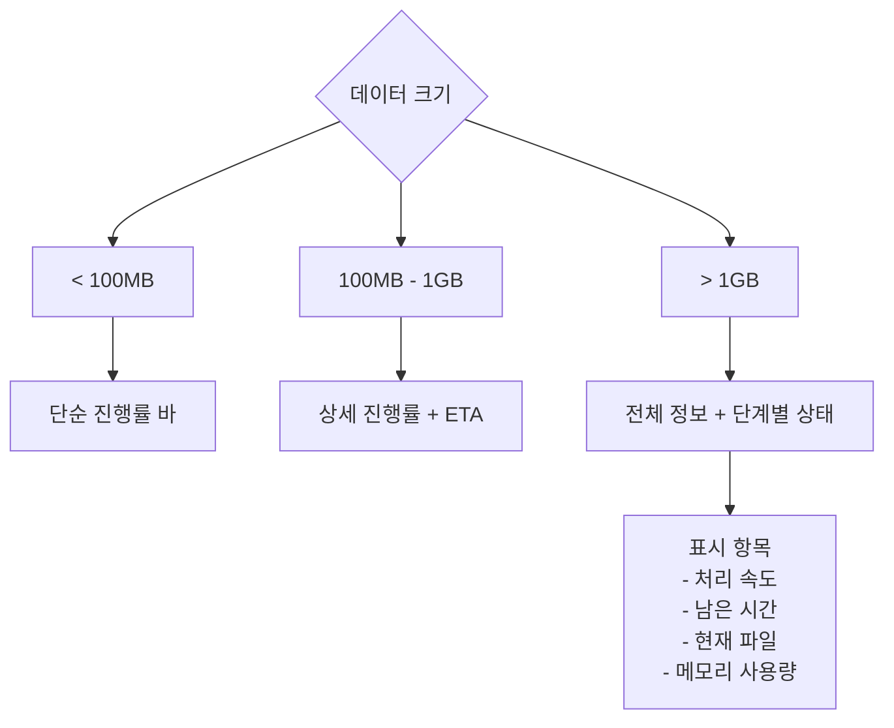

# 사용자 경험 디자인

## UX 디자인 원칙

### 1. 즉각적 피드백
사용자의 모든 행동에 즉시 반응하여 현재 상태를 명확히 전달합니다.

### 2. 점진적 공개
필수 정보는 먼저, 상세 정보는 나중에 표시합니다.

### 3. 에러 예방
실수하기 어려운 인터페이스로 설계하고, 위험한 작업은 확인을 요구합니다.

### 4. 명확한 안내
다음 단계가 무엇인지 항상 명확하게 제시합니다.

## 사용자 인터랙션 플로우

### 백업 작업 UX 플로우


### 복원 작업 안전 확인 플로우
```mermaid
graph TD
    Start[restore 명령] --> Check{--force 플래그?}
    
    Check -->|No| Warning[경고 메시지 표시]
    Warning --> ShowRisk[위험 요소 설명<br/>- 기존 파일 덮어쓰기<br/>- 데이터 손실 가능성]
    ShowRisk --> Suggest[안전한 대안 제시<br/>- --dry-run 사용<br/>- 백업 먼저 생성]
    Suggest --> End1[종료]
    
    Check -->|Yes| Validate[백업 파일 검증]
    Validate -->|실패| FileError[파일 문제 설명]
    FileError --> End2[종료]
    
    Validate -->|성공| Preview[작업 미리보기]
    Preview --> LastChance[최종 확인<br/>"Type 'yes' to continue:"]
    
    LastChance -->|No| Cancel[취소됨]
    LastChance -->|Yes| Execute[복원 실행]
    Execute --> Progress[진행률 표시]
    Progress --> Complete[완료]
```

## 피드백 레벨과 정보 계층

### 정보 표시 우선순위


### 진행률 표시 디자인
```
일반 모드:
Backing up... [████████████░░░░░░░] 75% • 1.2GB/1.6GB • 45s remaining

상세 모드 (-v):
Backing up nginx-pod:/var/www/html to ./backup-20240109.tar.gz
[████████████░░░░░░░] 75% • 1.2GB/1.6GB • 2.5MB/s • ETA: 45s
Files: 1,234/1,650 • Current: /var/www/html/assets/images/banner.jpg

디버그 모드 (-d):
[DEBUG] kubectl exec -n production nginx-pod -- tar -czf - /var/www/html
[DEBUG] Write buffer: 8192 bytes
[DEBUG] Checksum: calculating SHA256...
```

## 에러 처리와 복구 안내

### 에러 메시지 구조


### 에러 타입별 처리
```yaml
파일 찾을 수 없음:
  Error: "Backup file not found: backup.tar.gz"
  Reason: "The specified file does not exist in the current directory"
  Fix: "Check the file name or use 'cli-recover list backups' to see available backups"
  
권한 부족:
  Error: "Permission denied accessing /var/backup"
  Reason: "Current user lacks write permissions"
  Fix: "Run with sudo or change the output directory with -o flag"
  
네트워크 오류:
  Error: "Cannot connect to Kubernetes cluster"
  Reason: "kubectl connection failed"
  Fix: "Check your kubeconfig with 'kubectl cluster-info'"
```

## 출력 형식과 스타일

### 색상 사용 규칙


### 상태 아이콘 사용
```
✅ Success     - 작업 완료
⚠️  Warning     - 주의 필요
❌ Error       - 실패
ℹ️  Info        - 정보 제공
⏳ In Progress - 진행 중
🔄 Syncing     - 동기화 중
📦 Packaging   - 압축 중
```

## 대화형 프롬프트

### 확인 프롬프트 디자인
```
⚠️  This operation will overwrite existing files in the pod.

Target: nginx-pod:/var/www/html (namespace: production)
Source: backup-20240109.tar.gz (2.5GB)
Files to overwrite: 1,234

Do you want to continue? [y/N]: _
```

### 선택 프롬프트 디자인
```
Multiple backups found. Please select one:

  1) backup-20240109-140523.tar.gz (2.5GB) - 2 hours ago
  2) backup-20240108-093012.tar.gz (2.3GB) - yesterday  
  3) backup-20240107-180145.tar.gz (2.1GB) - 2 days ago

Enter number (1-3) or 'q' to quit: _
```

## 로그와 기록

### 작업 요약 출력
```
✅ Backup completed successfully!

Summary:
  Source:    nginx-pod:/var/www/html
  Namespace: production  
  Output:    ./backups/nginx-20240109-140523.tar.gz
  Size:      2.5GB (compressed from 4.2GB)
  Files:     1,234 files
  Duration:  3m 42s
  Checksum:  sha256:a1b2c3d4e5f6...

Next steps:
  • Verify: cli-recover restore filesystem --dry-run nginx-pod ./backups/nginx-20240109-140523.tar.gz
  • List:   cli-recover list backups
  • Logs:   cli-recover logs show backup-xyz123
```

## 도움말과 예제

### 도움말 구조
```
1. 간단한 설명 (1줄)
2. 상세 설명 (2-3줄)
3. 사용법 패턴
4. 실제 예제 (3-5개)
5. 관련 명령어
6. 추가 정보 링크
```

### 예제 중심 도움말
```bash
# 실제 도움말 예시
Examples:
  # Backup nginx pod's web root
  cli-recover backup filesystem nginx-pod /var/www/html
  
  # Backup with compression
  cli-recover backup filesystem nginx-pod /data -c gzip
  
  # Backup to specific file
  cli-recover backup filesystem nginx-pod /data -o my-backup.tar
  
  # Exclude log files
  cli-recover backup filesystem nginx-pod /app -e "*.log" -e "*.tmp"

See also:
  cli-recover restore filesystem - Restore from backup
  cli-recover list backups      - List all backups
```

## 성능 피드백

### 대용량 작업 시 피드백


## 접근성 고려사항

### 1. 스크린 리더 지원
- 진행률을 텍스트로도 표시
- 색상에만 의존하지 않는 정보 전달
- 명확한 상태 메시지

### 2. 최소 출력 모드
```bash
# Quiet mode for scripts
cli-recover backup filesystem nginx /data -q
# Output: backup-20240109-140523.tar.gz

# Machine-readable output
cli-recover list backups --format=json
```

### 3. 환경 적응
- CI/CD 환경 감지 시 색상 비활성화
- 터미널 크기에 따른 출력 조정
- 파이프 연결 시 간소화된 출력

## 사용자 피드백 수집

### 1. 에러 리포팅
```
❌ An unexpected error occurred.

Error ID: ERR-2024-0109-001
Would you like to create an issue? [Y/n]: 
```

### 2. 사용성 개선
- 자주 발생하는 에러 패턴 분석
- 사용자 행동 패턴 이해
- 개선 사항 우선순위 결정