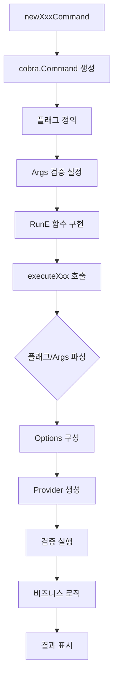

# 구현 가이드

## Cobra 명령 구현 패턴

### 명령어 생성 플로우


## 명령어 구현 템플릿

### 1. 기본 명령어 구조
```go
// cmd/cli-recover/backup.go
func newBackupCommand() *cobra.Command {
    cmd := &cobra.Command{
        Use:   "backup",
        Short: "Backup resources from Kubernetes",
        Long: `Backup various types of resources from Kubernetes pods.

Available backup types:
  filesystem - Backup files and directories from pod filesystem`,
        RunE: func(cmd *cobra.Command, args []string) error {
            // 서브커맨드 없이 실행되면 도움말 표시
            return cmd.Help()
        },
    }
    
    // 서브커맨드 추가
    cmd.AddCommand(newProviderBackupCmd("filesystem"))
    
    return cmd
}
```

### 2. Provider 명령어 구조
```go
func newProviderBackupCmd(providerName string) *cobra.Command {
    var cmd *cobra.Command
    
    switch providerName {
    case "filesystem":
        cmd = &cobra.Command{
            Use:   "filesystem [pod] [path]",
            Short: "Backup pod filesystem",
            Long:  `Backup files and directories from a pod's filesystem using tar`,
            Args:  cobra.ExactArgs(2), // 정확히 2개 인자 필요
            RunE: func(cmd *cobra.Command, args []string) error {
                return executeBackup(providerName, cmd, args)
            },
        }
        
        // 플래그 정의 (Registry 사용)
        cmd.Flags().StringP("namespace", flags.Registry.Namespace, "default", 
            "Kubernetes namespace")
        cmd.Flags().StringP("output", flags.Registry.Output, "", 
            "Output file path (auto-generated if not specified)")
        cmd.Flags().StringP("compression", flags.Registry.Compression, "none", 
            "Compression type (none, gzip)")
        // ... 더 많은 플래그
    }
    
    return cmd
}
```

### 3. 실행 함수 패턴
```go
func executeBackup(providerName string, cmd *cobra.Command, args []string) error {
    // 1. 컨텍스트 생성
    ctx := context.Background()
    
    // 2. 옵션 구성
    opts, err := buildBackupOptions(cmd, args)
    if err != nil {
        return fmt.Errorf("invalid options: %w", err)
    }
    
    // 3. 사용자에게 구성 표시
    if err := displayConfiguration(opts); err != nil {
        return err
    }
    
    // 4. Provider 생성
    provider := infrastructure.CreateBackupProvider(providerName)
    if provider == nil {
        return fmt.Errorf("unknown backup provider: %s", providerName)
    }
    
    // 5. 옵션 검증
    if err := provider.Validate(opts); err != nil {
        return fmt.Errorf("validation failed: %w", err)
    }
    
    // 6. 진행률 모니터링 시작
    done := make(chan bool)
    go monitorProgress(provider, done)
    
    // 7. 백업 실행
    result, err := provider.ExecuteWithResult(ctx, opts)
    close(done)
    
    if err != nil {
        return fmt.Errorf("backup failed: %w", err)
    }
    
    // 8. 결과 표시
    displayResult(result)
    
    // 9. 메타데이터 저장
    if err := saveMetadata(opts, result); err != nil {
        log.Warn("Failed to save metadata", logger.F("error", err))
    }
    
    return nil
}
```

## 플래그와 인자 처리

### 하이브리드 옵션 빌드
```go
func buildBackupOptions(cmd *cobra.Command, args []string) (*backup.Options, error) {
    opts := &backup.Options{}
    
    // 1. Positional arguments 처리
    if len(args) >= 1 {
        opts.Pod = args[0]
    }
    if len(args) >= 2 {
        opts.SourcePath = args[1]
    }
    
    // 2. 플래그 값 처리 (플래그가 우선)
    if pod, _ := cmd.Flags().GetString("pod"); pod != "" {
        opts.Pod = pod
    }
    if path, _ := cmd.Flags().GetString("path"); path != "" {
        opts.SourcePath = path
    }
    
    // 3. 나머지 플래그 처리
    opts.Namespace, _ = cmd.Flags().GetString("namespace")
    opts.OutputFile, _ = cmd.Flags().GetString("output")
    opts.Compression, _ = cmd.Flags().GetString("compression")
    opts.Exclude, _ = cmd.Flags().GetStringSlice("exclude")
    
    // 4. 기본값 처리
    if opts.OutputFile == "" {
        opts.OutputFile = generateOutputFileName(opts)
    }
    
    return opts, nil
}
```

### 플래그 레지스트리 사용
```go
// flags/shortcuts.go
package flags

// 중앙 집중식 플래그 관리
var Registry = struct {
    // Global
    Namespace string
    Verbose   string
    Debug     string
    
    // Backup
    Output      string
    Compression string
    Exclude     string
    Totals      string
    
    // Restore
    Force      string
    TargetPath string
    Container  string
}{
    Namespace:   "n",
    Verbose:     "v",
    Debug:       "d",
    Output:      "o",
    Compression: "c",
    Exclude:     "e",
    Totals:      "T",
    Force:       "f",
    TargetPath:  "t",
    Container:   "C",
}
```

## 에러 처리 패턴

### 계층별 에러 처리
```go
// Domain 레이어 에러
type BackupError struct {
    Code    ErrorCode
    Message string
    Cause   error
}

// Infrastructure 레이어에서 도메인 에러로 변환
func (p *FilesystemProvider) Execute(ctx context.Context, opts backup.Options) error {
    if err := p.validatePod(opts.Pod); err != nil {
        return backup.NewError(
            backup.ErrInvalidPod,
            fmt.Sprintf("pod '%s' not found", opts.Pod),
            err,
        )
    }
    // ...
}

// CLI 레이어에서 사용자 친화적 메시지로 변환
func handleError(err error) {
    var backupErr *backup.BackupError
    if errors.As(err, &backupErr) {
        switch backupErr.Code {
        case backup.ErrInvalidPod:
            fmt.Fprintf(os.Stderr, "❌ Error: %s\n", backupErr.Message)
            fmt.Fprintf(os.Stderr, "   Fix: Check pod name with 'kubectl get pods -n %s'\n", namespace)
        // ... 다른 에러 타입들
        }
    } else {
        // 일반 에러
        fmt.Fprintf(os.Stderr, "❌ Error: %v\n", err)
    }
}
```

## 진행률 표시 구현

### 진행률 모니터링
```go
func monitorProgress(provider backup.Provider, done <-chan bool) {
    progressCh := provider.StreamProgress()
    ticker := time.NewTicker(100 * time.Millisecond)
    defer ticker.Stop()
    
    var lastProgress backup.Progress
    startTime := time.Now()
    
    for {
        select {
        case <-done:
            // 최종 진행률 표시
            clearLine()
            return
            
        case progress, ok := <-progressCh:
            if !ok {
                return
            }
            lastProgress = progress
            
        case <-ticker.C:
            // 주기적으로 화면 업데이트
            displayProgress(lastProgress, startTime)
        }
    }
}

func displayProgress(p backup.Progress, start time.Time) {
    percentage := float64(p.BytesProcessed) / float64(p.TotalBytes) * 100
    elapsed := time.Since(start)
    speed := float64(p.BytesProcessed) / elapsed.Seconds()
    eta := calculateETA(p, speed)
    
    // 진행률 바 생성
    barWidth := 30
    filled := int(percentage / 100 * float64(barWidth))
    bar := strings.Repeat("█", filled) + strings.Repeat("░", barWidth-filled)
    
    // 출력
    fmt.Printf("\r⏳ Backing up... [%s] %.1f%% • %s/%s • %.1f MB/s • ETA: %s",
        bar, percentage,
        humanize.Bytes(p.BytesProcessed),
        humanize.Bytes(p.TotalBytes),
        speed/1024/1024,
        eta,
    )
}
```

## 테스트 가능한 구조

### 의존성 주입
```go
// 테스트 가능한 구조를 위한 인터페이스
type CommandExecutor interface {
    Execute(ctx context.Context, cmd []string) error
    StreamBinary(ctx context.Context, cmd []string) (io.ReadCloser, io.ReadCloser, func() error, error)
}

// Provider 생성 시 의존성 주입
func NewFilesystemProvider(executor CommandExecutor) *FilesystemProvider {
    return &FilesystemProvider{
        executor: executor,
    }
}

// 테스트에서 Mock 사용
func TestBackupExecution(t *testing.T) {
    mockExecutor := &MockCommandExecutor{}
    provider := NewFilesystemProvider(mockExecutor)
    
    // Mock 설정
    mockExecutor.On("StreamBinary", mock.Anything, mock.Anything).
        Return(mockReader, nil, nil, nil)
    
    // 테스트 실행
    err := provider.Execute(context.Background(), opts)
    assert.NoError(t, err)
    mockExecutor.AssertExpectations(t)
}
```

## 설정 통합

### 설정 우선순위


### 설정 로드
```go
func loadConfiguration(cmd *cobra.Command) *config.Config {
    // 1. 기본 설정
    cfg := config.DefaultConfig()
    
    // 2. 설정 파일 로드
    if configFile, _ := cmd.Flags().GetString("config"); configFile != "" {
        if fileCfg, err := config.LoadFile(configFile); err == nil {
            cfg.Merge(fileCfg)
        }
    }
    
    // 3. 환경 변수 오버라이드
    cfg.LoadFromEnv()
    
    // 4. CLI 플래그 오버라이드
    if logLevel, _ := cmd.Flags().GetString("log-level"); logLevel != "" {
        cfg.Logger.Level = logLevel
    }
    
    return cfg
}
```

## 로깅 통합

### 구조화된 로깅
```go
// 로거 초기화
log := logger.GetGlobalLogger()

// 구조화된 로그
log.Info("Backup started",
    logger.F("pod", opts.Pod),
    logger.F("namespace", opts.Namespace),
    logger.F("path", opts.SourcePath),
)

// 에러 로깅
if err != nil {
    log.Error("Backup failed",
        logger.F("error", err),
        logger.F("duration", time.Since(start)),
    )
}
```

## 성능 최적화

### 1. 스트리밍 처리
```go
// 메모리 효율적인 스트리밍
func streamBackup(reader io.Reader, writer io.Writer) error {
    // 버퍼 크기 최적화
    buf := make([]byte, 32*1024) // 32KB 버퍼
    
    // io.Copy 대신 직접 제어
    for {
        n, err := reader.Read(buf)
        if n > 0 {
            if _, writeErr := writer.Write(buf[:n]); writeErr != nil {
                return writeErr
            }
        }
        if err == io.EOF {
            break
        }
        if err != nil {
            return err
        }
    }
    
    return nil
}
```

### 2. 동시성 활용
```go
// 여러 작업 병렬 처리
func processMultipleBackups(pods []string) error {
    var wg sync.WaitGroup
    errCh := make(chan error, len(pods))
    
    // 동시 실행 제한
    sem := make(chan struct{}, 3) // 최대 3개 동시 실행
    
    for _, pod := range pods {
        wg.Add(1)
        go func(p string) {
            defer wg.Done()
            
            sem <- struct{}{}        // 세마포어 획득
            defer func() { <-sem }() // 세마포어 해제
            
            if err := backupPod(p); err != nil {
                errCh <- fmt.Errorf("pod %s: %w", p, err)
            }
        }(pod)
    }
    
    wg.Wait()
    close(errCh)
    
    // 에러 수집
    var errs []error
    for err := range errCh {
        errs = append(errs, err)
    }
    
    if len(errs) > 0 {
        return fmt.Errorf("multiple errors: %v", errs)
    }
    
    return nil
}
```

## 보안 고려사항

### 1. 입력 검증
```go
func validatePath(path string) error {
    // Path traversal 방지
    if strings.Contains(path, "..") {
        return errors.New("path cannot contain '..'")
    }
    
    // 절대 경로만 허용
    if !filepath.IsAbs(path) {
        return errors.New("path must be absolute")
    }
    
    // 위험한 경로 차단
    dangerousPaths := []string{"/", "/etc", "/var", "/usr"}
    for _, dangerous := range dangerousPaths {
        if path == dangerous {
            return fmt.Errorf("cannot backup system directory: %s", path)
        }
    }
    
    return nil
}
```

### 2. 권한 확인
```go
func checkPermissions(file string) error {
    info, err := os.Stat(file)
    if err != nil {
        return err
    }
    
    // 파일 권한 확인
    if info.Mode().Perm()&0600 != 0600 {
        return fmt.Errorf("file permissions too open: %v", info.Mode())
    }
    
    return nil
}
```