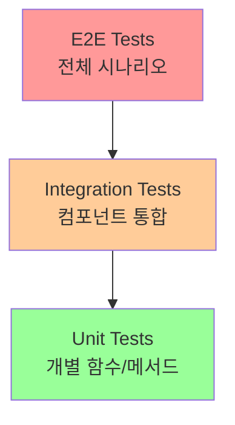
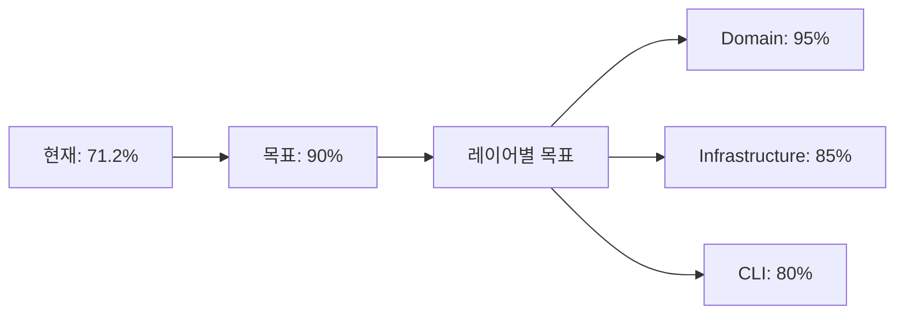

# 테스트 전략

## 테스트 피라미드



### 테스트 비율
- **Unit Tests**: 70% - 빠르고 집중적
- **Integration Tests**: 25% - 주요 통합 지점
- **E2E Tests**: 5% - 핵심 시나리오만

## 테스트 커버리지 전략

### 커버리지 목표 (CLAUDE.md 준수)


### 테스트 우선순위
1. **도메인 로직**: 비즈니스 규칙 100% 커버
2. **에러 처리**: 모든 에러 경로 테스트
3. **경계 조건**: Edge cases 집중 테스트
4. **통합 지점**: Provider 인터페이스

## CLI 명령어 테스트

### 1. 명령어 구조 테스트
```go
func TestBackupCommand_Structure(t *testing.T) {
    cmd := newBackupCommand()
    
    // 기본 속성 검증
    assert.Equal(t, "backup", cmd.Use)
    assert.NotEmpty(t, cmd.Short)
    assert.NotEmpty(t, cmd.Long)
    
    // 서브커맨드 검증
    assert.NotNil(t, cmd.Commands())
    assert.Len(t, cmd.Commands(), 1) // filesystem
    
    // 플래그 존재 확인
    filesystemCmd := getSubcommand(cmd, "filesystem")
    assert.NotNil(t, filesystemCmd.Flags().Lookup("namespace"))
    assert.NotNil(t, filesystemCmd.Flags().Lookup("output"))
}
```

### 2. 플래그 파싱 테스트
```go
func TestBackupCommand_FlagParsing(t *testing.T) {
    tests := []struct {
        name     string
        args     []string
        wantErr  bool
        validate func(t *testing.T, cmd *cobra.Command)
    }{
        {
            name: "basic flags",
            args: []string{"filesystem", "nginx", "/data", "-n", "prod"},
            validate: func(t *testing.T, cmd *cobra.Command) {
                ns, _ := cmd.Flags().GetString("namespace")
                assert.Equal(t, "prod", ns)
            },
        },
        {
            name: "multiple excludes",
            args: []string{"filesystem", "nginx", "/data", "-e", "*.log", "-e", "*.tmp"},
            validate: func(t *testing.T, cmd *cobra.Command) {
                excludes, _ := cmd.Flags().GetStringSlice("exclude")
                assert.Equal(t, []string{"*.log", "*.tmp"}, excludes)
            },
        },
    }
    
    for _, tt := range tests {
        t.Run(tt.name, func(t *testing.T) {
            cmd := newBackupCommand()
            cmd.SetArgs(tt.args)
            
            err := cmd.Execute()
            if tt.wantErr {
                assert.Error(t, err)
            } else {
                assert.NoError(t, err)
                tt.validate(t, cmd)
            }
        })
    }
}
```

### 3. 인자 검증 테스트
```go
func TestBackupCommand_ArgsValidation(t *testing.T) {
    tests := []struct {
        name    string
        args    []string
        wantErr string
    }{
        {
            name:    "missing pod",
            args:    []string{"filesystem"},
            wantErr: "requires exactly 2 arg(s)",
        },
        {
            name:    "missing path",
            args:    []string{"filesystem", "nginx"},
            wantErr: "requires exactly 2 arg(s)",
        },
        {
            name:    "too many args",
            args:    []string{"filesystem", "nginx", "/data", "extra"},
            wantErr: "requires exactly 2 arg(s)",
        },
        {
            name: "valid args",
            args: []string{"filesystem", "nginx", "/data"},
        },
    }
    
    for _, tt := range tests {
        t.Run(tt.name, func(t *testing.T) {
            // 실제 실행 없이 args 검증만
            cmd := newProviderBackupCmd("filesystem")
            err := cmd.Args(cmd, tt.args[1:]) // filesystem 제외
            
            if tt.wantErr != "" {
                assert.Error(t, err)
                assert.Contains(t, err.Error(), tt.wantErr)
            } else {
                assert.NoError(t, err)
            }
        })
    }
}
```

## 플래그 충돌 테스트

### 1. 플래그 중복 검사
```go
func TestFlagConsistency(t *testing.T) {
    // 모든 명령어 초기화
    rootCmd := createRootCommand()
    addGlobalFlags(rootCmd)
    addSubcommands(rootCmd)
    
    // 플래그 수집
    flagMap := make(map[string][]string) // shortcut -> commands
    
    walkCommands(rootCmd, func(cmd *cobra.Command, path string) {
        cmd.Flags().VisitAll(func(flag *pflag.Flag) {
            if flag.Shorthand != "" {
                flagMap[flag.Shorthand] = append(
                    flagMap[flag.Shorthand], 
                    fmt.Sprintf("%s/%s", path, flag.Name),
                )
            }
        })
    })
    
    // 충돌 검사
    for shortcut, usages := range flagMap {
        if len(usages) > 1 {
            // 같은 의미인지 확인
            meanings := make(map[string]bool)
            for _, usage := range usages {
                parts := strings.Split(usage, "/")
                flagName := parts[len(parts)-1]
                meanings[flagName] = true
            }
            
            if len(meanings) > 1 {
                t.Errorf("Flag -%s has different meanings: %v", 
                    shortcut, usages)
            }
        }
    }
}
```

### 2. 플래그 레지스트리 테스트
```go
func TestFlagRegistry_NoDuplicates(t *testing.T) {
    seen := make(map[string]string)
    
    v := reflect.ValueOf(flags.Registry)
    typ := v.Type()
    
    for i := 0; i < v.NumField(); i++ {
        field := typ.Field(i)
        value := v.Field(i).String()
        
        if value == "" {
            continue // 단축키 없음
        }
        
        if existing, exists := seen[value]; exists {
            t.Errorf("Duplicate shortcut '%s': %s and %s", 
                value, existing, field.Name)
        }
        
        seen[value] = field.Name
    }
}
```

## 통합 테스트

### 1. Provider 통합 테스트
```go
func TestBackupIntegration_FilesystemProvider(t *testing.T) {
    // 테스트 환경 설정
    tempDir := t.TempDir()
    mockExecutor := &MockCommandExecutor{}
    provider := filesystem.NewProvider(mockExecutor)
    
    // Mock 설정
    tarData := createTestTarData()
    mockExecutor.On("StreamBinary", mock.Anything, mock.MatchedBy(func(cmd []string) bool {
        return cmd[0] == "kubectl" && cmd[1] == "exec"
    })).Return(
        ioutil.NopCloser(bytes.NewReader(tarData)),
        ioutil.NopCloser(strings.NewReader("")),
        func() error { return nil },
        nil,
    )
    
    // 백업 실행
    opts := backup.Options{
        Namespace:  "default",
        Pod:        "test-pod",
        SourcePath: "/data",
        OutputFile: filepath.Join(tempDir, "backup.tar"),
    }
    
    result, err := provider.ExecuteWithResult(context.Background(), opts)
    
    // 검증
    assert.NoError(t, err)
    assert.FileExists(t, opts.OutputFile)
    assert.Equal(t, int64(len(tarData)), result.Size)
    assert.NotEmpty(t, result.Checksum)
    
    // 파일 내용 검증
    data, _ := os.ReadFile(opts.OutputFile)
    assert.Equal(t, tarData, data)
}
```

### 2. 엔드투엔드 시나리오 테스트
```go
func TestE2E_BackupRestoreScenario(t *testing.T) {
    if testing.Short() {
        t.Skip("Skipping E2E test in short mode")
    }
    
    // 실제 kubectl 명령 사용 (또는 Mock)
    tempDir := t.TempDir()
    
    // 1. 백업 실행
    backupCmd := exec.Command("go", "run", "./cmd/cli-recover",
        "backup", "filesystem", "test-pod", "/data",
        "-o", filepath.Join(tempDir, "backup.tar"))
    
    output, err := backupCmd.CombinedOutput()
    require.NoError(t, err, "Backup failed: %s", output)
    
    // 2. 백업 파일 확인
    assert.FileExists(t, filepath.Join(tempDir, "backup.tar"))
    
    // 3. 복원 실행
    restoreCmd := exec.Command("go", "run", "./cmd/cli-recover",
        "restore", "filesystem", "test-pod", 
        filepath.Join(tempDir, "backup.tar"),
        "--force")
    
    output, err = restoreCmd.CombinedOutput()
    require.NoError(t, err, "Restore failed: %s", output)
    
    // 4. 결과 검증
    assert.Contains(t, string(output), "Restore completed successfully")
}
```

## 에러 시나리오 테스트

### 1. 에러 처리 테스트
```go
func TestErrorHandling(t *testing.T) {
    tests := []struct {
        name          string
        setupMock     func(*MockCommandExecutor)
        expectedError string
    }{
        {
            name: "pod not found",
            setupMock: func(m *MockCommandExecutor) {
                m.On("StreamBinary", mock.Anything, mock.Anything).
                    Return(nil, nil, nil, errors.New("pod not found"))
            },
            expectedError: "pod not found",
        },
        {
            name: "permission denied",
            setupMock: func(m *MockCommandExecutor) {
                m.On("StreamBinary", mock.Anything, mock.Anything).
                    Return(nil, nil, nil, errors.New("permission denied"))
            },
            expectedError: "permission denied",
        },
    }
    
    for _, tt := range tests {
        t.Run(tt.name, func(t *testing.T) {
            mockExecutor := &MockCommandExecutor{}
            tt.setupMock(mockExecutor)
            
            provider := filesystem.NewProvider(mockExecutor)
            err := provider.Execute(context.Background(), testOpts)
            
            assert.Error(t, err)
            assert.Contains(t, err.Error(), tt.expectedError)
        })
    }
}
```

### 2. 경계 조건 테스트
```go
func TestBoundaryConditions(t *testing.T) {
    tests := []struct {
        name  string
        input interface{}
        test  func(t *testing.T)
    }{
        {
            name:  "empty path",
            input: "",
            test: func(t *testing.T) {
                err := validatePath("")
                assert.Error(t, err)
            },
        },
        {
            name:  "path with ..",
            input: "/data/../etc",
            test: func(t *testing.T) {
                err := validatePath("/data/../etc")
                assert.Error(t, err)
            },
        },
        {
            name:  "zero size file",
            input: int64(0),
            test: func(t *testing.T) {
                progress := calculateProgress(0, 0)
                assert.Equal(t, 100.0, progress)
            },
        },
    }
    
    for _, tt := range tests {
        t.Run(tt.name, func(t *testing.T) {
            tt.test(t)
        })
    }
}
```

## 성능 테스트

### 1. 벤치마크 테스트
```go
func BenchmarkBackupLargeFile(b *testing.B) {
    // 100MB 테스트 데이터
    data := make([]byte, 100*1024*1024)
    rand.Read(data)
    
    b.ResetTimer()
    
    for i := 0; i < b.N; i++ {
        provider := &FilesystemProvider{}
        reader := bytes.NewReader(data)
        
        // 백업 시뮬레이션
        var buf bytes.Buffer
        _, err := io.Copy(&buf, reader)
        if err != nil {
            b.Fatal(err)
        }
    }
    
    b.ReportMetric(float64(len(data))/float64(b.Elapsed().Seconds()), "bytes/sec")
}
```

### 2. 동시성 테스트
```go
func TestConcurrentBackups(t *testing.T) {
    const numGoroutines = 10
    
    var wg sync.WaitGroup
    errors := make(chan error, numGoroutines)
    
    for i := 0; i < numGoroutines; i++ {
        wg.Add(1)
        go func(id int) {
            defer wg.Done()
            
            opts := backup.Options{
                Pod:        fmt.Sprintf("pod-%d", id),
                OutputFile: fmt.Sprintf("backup-%d.tar", id),
                // ...
            }
            
            provider := createTestProvider()
            if err := provider.Execute(context.Background(), opts); err != nil {
                errors <- err
            }
        }(i)
    }
    
    wg.Wait()
    close(errors)
    
    // 에러 확인
    for err := range errors {
        t.Errorf("Concurrent backup failed: %v", err)
    }
}
```

## 테스트 유틸리티

### 1. 테스트 헬퍼
```go
// test_helpers.go
func createTestCommand(args ...string) (*cobra.Command, *bytes.Buffer, *bytes.Buffer) {
    cmd := createRootCommand()
    
    stdout := &bytes.Buffer{}
    stderr := &bytes.Buffer{}
    
    cmd.SetOut(stdout)
    cmd.SetErr(stderr)
    cmd.SetArgs(args)
    
    return cmd, stdout, stderr
}

func executeCommand(t *testing.T, args ...string) (string, string, error) {
    cmd, stdout, stderr := createTestCommand(args...)
    err := cmd.Execute()
    
    return stdout.String(), stderr.String(), err
}
```

### 2. Mock 생성기
```go
func createMockProvider(t *testing.T) *MockProvider {
    mock := &MockProvider{}
    
    // 기본 동작 설정
    mock.On("Name").Return("mock")
    mock.On("Validate", mock.Anything).Return(nil)
    mock.On("StreamProgress").Return(make(<-chan backup.Progress))
    
    return mock
}
```

## CI/CD 통합

### GitHub Actions 테스트
```yaml
name: Tests

on: [push, pull_request]

jobs:
  test:
    runs-on: ubuntu-latest
    steps:
      - uses: actions/checkout@v3
      
      - uses: actions/setup-go@v4
        with:
          go-version: '1.21'
      
      - name: Run tests
        run: make test
      
      - name: Check coverage
        run: make coverage
        
      - name: Upload coverage
        uses: codecov/codecov-action@v3
        with:
          file: ./coverage.out
```

## 테스트 체크리스트

### 새 기능 추가 시
- [ ] Unit test 작성 (TDD)
- [ ] Integration test 추가
- [ ] Error case 테스트
- [ ] Flag 충돌 검사
- [ ] 문서 업데이트
- [ ] 벤치마크 (성능 중요 시)

### 릴리즈 전
- [ ] 전체 테스트 통과
- [ ] 커버리지 90% 이상
- [ ] E2E 시나리오 통과
- [ ] 성능 회귀 없음
- [ ] 문서 일치성 확인